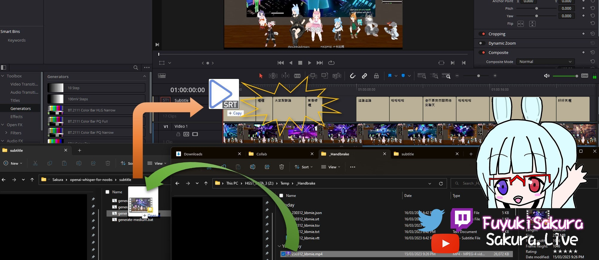

# OpenAI Whisper for noobs

Provides a one-click solution for **installing** and **creating transcripts** with OpenAI whisper for people with minimum technical knowledge.

## Usage

### Install on Windows

Right click the `install.bat` or `install-nvidia.bat` file
and **Run as administrator** to install OpenAI Whisper and it's dependencies.

> The install.bat files must run with **elevated privileges**

| File | Description |
| ---- | ----------- |
| install.bat | Installs OpenAI Whisper |
| install-nvidia.bat | installs OpenAI Whisper with CUDA support (Nvidia GPU acceleration) |

### Creating a time-coded subtitle transcript

1. Drag and drop the video file into the `generate-<model>.bat` file inside the `subtitle` folder.
2. The generated subtitle file will be in the same folder as the video file.

| File | Description | Note |
| ---- | ----------- | ---- |
| generate-base.bat | Uses the `base` model | Less accurate but faster |
| generate-medium.bat | Uses the `medium` model | Good balance between accuracy and speed. |
| generate-large.bat | Uses the `large` model | The most accurate but slower |
| generate-en.bat | Uses the `medium.en` model | For English only videos. In most cases, this Medium English model is accurate enough. |
